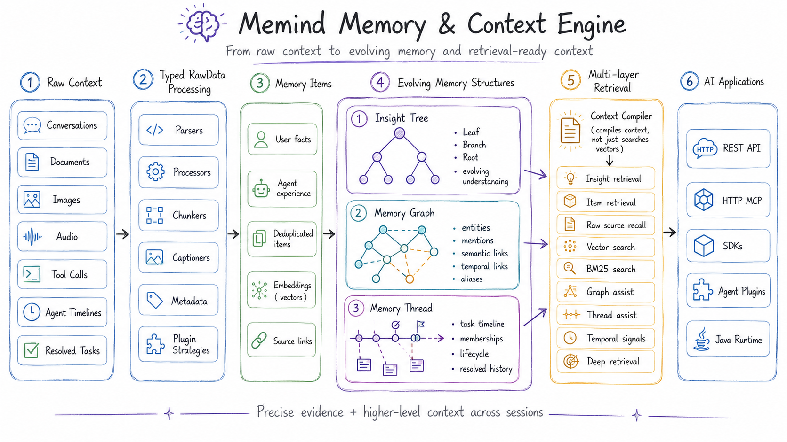

<p align="center">
  
</p>

<h1 align="center">Memind</h1>

<h3 align="center">
  <em>Memory that thinks. Context that evolves.</em>
</h3>

<p align="center">
  The memory layer that lets AI systems learn from every conversation,
  tool call, document, and resolved task.
</p>

<p align="center">
  Memind turns raw context into structured memory and reusable experience,
  continuously organizes it into memory graphs, threads, and evolving Insight Trees,
  then recalls the right context through REST, MCP, SDKs, and first-party plugins
  for popular agents.
</p>

<p align="center">
  <a href="./LICENSE"></a>
  <a href="#"></a>
  <a href="#"></a>
  <a href="./README_zh.md"></a>
  <a href="https://github.com/openmemind/memind"></a>
</p>

<p align="center">
  <a href="#benchmark"></a>
  <a href="#benchmark"></a>
  <a href="#benchmark"></a>
  <a href="#mcp-server"></a>
  <a href="#official-api-clients"></a>
  <a href="#agent-integrations"></a>
</p>

<p align="center">
  <a href="#highlights">Highlights</a> ·
  <a href="#quick-start">Quick Start</a> ·
  <a href="#integrations">Integrations</a> ·
  <a href="#benchmark">Benchmark</a>
</p>

---

<a id="highlights"></a>

## 🏆 Highlights

**Memind** achieves **state-of-the-art results across all three mainstream long-memory benchmarks**: LoCoMo, LongMemEval, and PersonaMem.

- ☕ **The first Java-native SOTA memory and context engine for AI agents:** built natively in Java, memind brings benchmark-leading long-memory performance into the Java ecosystem.
- 🚀 **Highest reported results across all three benchmarks:** under aligned **MemOS / EverMemOS-style evaluation**, memind ranks **#1 among the listed baselines** on **LoCoMo**, **LongMemEval**, and **PersonaMem**, surpassing **EverMemOS** on **LoCoMo** and **LongMemEval** and exceeding **MemOS** on **PersonaMem**. See [Benchmark](#benchmark) for full scores, category-level comparisons, context tokens, and evaluation protocol.
- 🧩 **One memory engine for users and agents:** memind separates USER memory from AGENT memory, letting the same system remember user profiles, preferences, and life context while also preserving agent directives, tool experience, playbooks, and resolved-task knowledge across coding agents, local harness agents, chatbots, companions, copilots, and workflow agents.
- 🌳 **Insight Tree turns memory into evolving intelligence:** instead of storing isolated facts, memind continuously distills raw memories into Leaf → Branch → Root insights, revealing patterns, preferences, causal signals, and high-level understanding that flat memory cannot capture. See [docs.openmemind.com](https://docs.openmemind.com).
- 🔎 **Multi-layer retrieval recalls the right context:** memind retrieves across Insight Trees, Memory Items, raw source data, Memory Graphs, Memory Threads, vector search, BM25 keyword search, temporal signals, and optional Deep Retrieval with query expansion, sufficiency checking, and reranking.
- 📥 **Memory for every kind of context:** memind can ingest conversations, documents, images, audio, tool calls, and agent timelines, then uses typed processors, parsers, chunkers, captioners, and plugin-specific extraction strategies to turn them into searchable memory.
- 🕸️ **Memory Graph connects scattered context:** memind materializes entities, mentions, semantic links, temporal links, causal links, aliases, and co-occurrence signals from extracted memories, then uses graph expansion to recover related context that pure vector similarity can miss.
- 🧵 **Memory Thread preserves evolving tasks and episodes:** memind groups related memory items into durable threads with timeline events, memberships, lifecycle state, enrichment, and retrieval-time thread assist, helping agents continue unfinished work and reuse resolved task history.

## Overview

### What is Memind?

Memind is an open-source, self-evolving memory and context engine for AI applications and agents.

It is not a vector-store wrapper. Memind captures raw context from conversations, documents, images, audio, tool calls, agent timelines, and resolved tasks, then turns it into structured user memory, reusable agent experience, evolving insights, connected memory graphs, and task-aware memory threads.

At retrieval time, Memind assembles the right context across these memory layers and exposes it through REST APIs, HTTP MCP tools, SDKs, Java runtime APIs, and first-party agent integrations.

### How Memind Works

<p align="center">
  
</p>

Memind keeps the raw source, extracted memory, structured understanding, graph relationships, and task timelines connected. This lets AI systems retrieve both precise evidence and higher-level context instead of relying on flat snippets alone.

### Use Memind for

Memind is a general memory and context layer for almost any AI system that needs long-term context. Common use cases include:

| Scenario | What Memind remembers |
|----------|-----------------------|
| Coding agents | Project context, tool experience, resolved tasks, durable instructions |
| Local personal agents | User preferences, long-running timelines, local workflows |
| Chatbots and companions | User profiles, relationships, behavior patterns, life events |
| Workflow agents | Directives, playbooks, operational context, task history |

These are only examples. Memind can also support copilots, enterprise assistants, support automation, research tools, knowledge workers, and any AI application that needs to remember users, tasks, documents, decisions, tools, timelines, and previous outcomes across sessions.

For deeper architecture, configuration, rawdata plugins, MCP tools, SDKs, and agent integrations, see [docs.openmemind.com](https://docs.openmemind.com).

---

## Quick Start

Choose the path that matches how you want to use Memind:

- **Docker Compose (Recommended):** start `memind-server` and the admin UI with one command.
- **Local development:** run `memind-server` and `memind-ui` directly from source.
- **Embedded Java runtime:** run Memind inside your own Java or Spring Boot application.

### Option 1: Docker Compose (Recommended)

#### Prerequisites

- Docker with the Compose plugin
- A model provider key for the chat and embedding models you want to use

#### Configure `.env`

Create a local `.env` file:

```bash
cp .env.example .env
```

For the default setup, edit these values first:

```env
OPENAI_API_KEY=your-api-key
OPENAI_BASE_URL=https://openrouter.ai/api
OPENAI_CHAT_MODEL=openai/gpt-4o-mini
OPENAI_EMBEDDING_MODEL=openai/text-embedding-3-small
```

The default `openai` client can point to OpenAI or any OpenAI-compatible endpoint by changing
`OPENAI_BASE_URL` and the model names. OpenRouter, DeepSeek, GLM, SiliconFlow, and similar
providers can be used through the same `openai` provider path when they expose an
OpenAI-compatible API.

Model names are provider-specific. The default values use OpenRouter-style model names. If you use
OpenAI directly, use OpenAI model names such as `gpt-4o-mini` and `text-embedding-3-small`.

#### Start Memind

```bash
docker compose up -d --build
```

After the containers start:

- Admin UI: `http://localhost:8080`
- Server health check: `http://localhost:8366/open/v1/health`
- Open API base path: `http://localhost:8366/open/v1`
- Admin API base path: `http://localhost:8366/admin/v1`
- HTTP MCP endpoint: `http://localhost:8366/mcp`

#### Verify

```bash
curl http://localhost:8366/open/v1/health
```

The health endpoint verifies that the server is running. Model credentials are validated when
Memind performs extraction, retrieval, embedding, or rerank calls.

The UI container proxies `/open/*` and `/admin/*` to `memind-server`, so the browser can use the
UI as a same-origin local admin console.

#### Common commands

```bash
# View logs
docker compose logs -f memind-server
docker compose logs -f memind-ui

# Stop containers but keep persisted memory data
docker compose down

# Stop containers and remove persisted memory data
docker compose down -v
```

By default, `memind-server` stores SQLite data and the fallback file vector store in the Docker
volume `memind-data`, mounted at `/app/data` inside the container.

The Compose setup is intended for local development and inspection. The admin UI has no built-in
authentication, so do not expose it directly to public networks.

<details>
<summary>Advanced: configure model routing</summary>

Memind has two AI configuration layers:

| Layer | Purpose |
|-------|---------|
| `spring.ai.*` | Provider defaults, API keys, base URLs, and model options |
| `memind.ai.*` | Named chat/embedding clients and slot routing inside the memory pipeline |

The default server configuration defines one chat client and one embedding client:

```yaml
memind:
  ai:
    chat:
      default-client: openai
      clients:
        openai:
          provider: openai
    embedding:
      client: openai
      clients:
        openai:
          provider: openai
```

Supported `memind.ai` providers:

| Usage | Providers |
|-------|-----------|
| Chat | `openai`, `anthropic`, `google`, `ollama` |
| Embedding | `openai`, `google`, `ollama` |

Use `provider: openai` for OpenAI-compatible providers such as DeepSeek, GLM, OpenRouter, or
SiliconFlow.

For advanced routing, add named clients in
[`application.yml`](./memind-server/src/main/resources/application.yml), then assign specific
memory pipeline slots to those clients:

```yaml
memind:
  ai:
    chat:
      default-client: ds
      clients:
        ds:
          provider: openai
          base-url: https://api.deepseek.com
          api-key: ${DEEPSEEK_API_KEY}
          model: deepseek-chat
        ds_reasoner:
          provider: openai
          base-url: https://api.deepseek.com
          api-key: ${DEEPSEEK_API_KEY}
          model: deepseek-reasoner
        claude:
          provider: anthropic
          api-key: ${ANTHROPIC_API_KEY}
          model: claude-sonnet-4-5
      slots:
        ITEM_EXTRACTION: ds
        INSIGHT_GENERATOR: ds_reasoner
        THREAD_ENRICHMENT: claude
```

Unconfigured slots automatically use `default-client`.

When using Docker Compose, rebuild the image after changing `application.yml`:

```bash
docker compose up -d --build
```

Full configuration details are available at [docs.openmemind.com](https://docs.openmemind.com).

</details>

### Option 2: Local Development

Use this path when you want to develop Memind itself or run the server and UI directly from source.

#### Prerequisites

- Java 21
- Maven
- Node.js 20.19+ or 22+
- pnpm
- A valid model provider key

#### Start `memind-server`

```bash
OPENAI_API_KEY=your-key \
mvn -pl memind-server -am spring-boot:run
```

The server starts at:

- Server health check: `http://localhost:8366/open/v1/health`
- Open API base path: `http://localhost:8366/open/v1`
- Admin API base path: `http://localhost:8366/admin/v1`
- HTTP MCP endpoint: `http://localhost:8366/mcp`

#### Start `memind-ui`

In another terminal:

```bash
cd memind-ui
pnpm install
pnpm dev
```

The Vite dev server starts at `http://localhost:5173` and proxies `/admin/*` requests to
`memind-server` on port `8366`.

### Option 3: Embedded Java Runtime

Use this path when you want Memind as an in-process Java memory engine instead of calling a separate
`memind-server`.

| Runtime style | Best for |
|---------------|----------|
| Spring Boot starter | Using Spring configuration and auto-configured AI/JDBC beans in a Boot application |
| Plain Java | Full control over `Memory.builder()`, model clients, storage, vector search, and runtime options |

#### Add dependencies

Import the Memind BOM first, then add the core runtime, the Spring AI plugin, and one JDBC dialect
plugin.

The dependency snippet below shows the plain-Java path. For Spring Boot, use
`memind-plugin-ai-spring-ai-starter`, `memind-plugin-jdbc-starter`, and Spring configuration.

For the default SQLite setup:

```xml
<dependencyManagement>
  <dependencies>
    <dependency>
      <groupId>com.openmemind.ai</groupId>
      <artifactId>memind-dependencies</artifactId>
      <version>0.2.0</version>
      <type>pom</type>
      <scope>import</scope>
    </dependency>
  </dependencies>
</dependencyManagement>

<dependencies>
  <dependency>
    <groupId>com.openmemind.ai</groupId>
    <artifactId>memind-core</artifactId>
  </dependency>
  <dependency>
    <groupId>com.openmemind.ai</groupId>
    <artifactId>memind-plugin-ai-spring-ai</artifactId>
  </dependency>
  <dependency>
    <groupId>com.openmemind.ai</groupId>
    <artifactId>memind-plugin-jdbc-sqlite</artifactId>
  </dependency>
</dependencies>
```

If you use MySQL or PostgreSQL, replace `memind-plugin-jdbc-sqlite` with
`memind-plugin-jdbc-mysql` or `memind-plugin-jdbc-postgresql`.

#### Minimal usage

Once the `Memory` runtime is assembled, the core API is small:

```java
var memoryId = DefaultMemoryId.of("user-1", "my-agent");

// messages = your conversation history
memory.addMessages(memoryId, messages).block();

var retrieval = memory.retrieve(
        memoryId,
        "What does the user prefer?",
        RetrievalConfig.Strategy.SIMPLE).block();
```

For a complete plain-Java runtime assembly with centralized defaults, start with
[`ExampleSettings.java`](./memind-examples/memind-example-java/src/main/java/com/openmemind/ai/memory/example/java/support/ExampleSettings.java).

#### Full runnable Java examples

The maintained Java examples live in
[`memind-examples/memind-example-java`](./memind-examples/memind-example-java).

| Example | What it shows |
|---------|---------------|
| `quickstart` | Basic `addMessages` and retrieval flow |
| `agent` | Agent-scoped memory, reusable task experience, and agent retrieval |
| `insight` | Multi-batch extraction and Insight Tree retrieval |
| `document` | Document rawdata ingestion and searchable document memory |
| `foresight` | Foresight extraction and forward-looking context retrieval |
| `tool` | Tool-call reporting, tool memory, and tool statistics |

Run the default quickstart example:

```bash
OPENAI_API_KEY=your-key \
mvn -pl memind-examples/memind-example-java -am -DskipTests \
  -Dexec.mainClass=com.openmemind.ai.memory.example.java.quickstart.QuickStartExample \
  exec:java
```

<a id="integrations"></a>

## Integrations

Memind can be integrated through first-party agent plugins, SDKs, REST APIs, or the built-in HTTP MCP server.
Choose the path that matches where your AI system runs.

<a id="agent-integrations"></a>

### Connect Memind to Any Agent

Use first-party integrations when you want Memind to automatically recall context, inject memory,
and capture agent activity across sessions.

Memind provides official integrations for popular agents:

- [`Claude Code`](./memind-integrations/claude-code): persistent project memory, session-start continuity context, tool-aware context injection, and coding-agent timeline ingestion.
- [`Codex`](./memind-integrations/codex): persistent project memory, prompt/tool context injection, retry-backed timeline ingestion, and source tagging for Codex sessions.
- [`OpenClaw`](./memind-integrations/openclaw): prompt-time Memind recall plus completed OpenClaw agent activity ingestion as `agent_timeline` raw data.
- [`Hermes`](./memind-integrations/hermes): a native Hermes memory provider that retrieves relevant context before turns and captures completed Hermes activity after responses.

<a id="official-api-clients"></a>

### SDKs and REST APIs

Use SDKs and REST APIs when you want to connect Memind to an application, backend service, chatbot, workflow system, or custom agent.

Open API base path:

```text
http://localhost:8366/open/v1
```

Official API clients:

- TypeScript: [`memind-clients/typescript`](./memind-clients/typescript)
- Python: [`memind-clients/python`](./memind-clients/python)
- Java: [`memind-clients/java`](./memind-clients/java)
- Go: [`github.com/openmemind/memind/memind-clients/go`](./memind-clients/go)
- Rust: [`memind-clients/rust`](./memind-clients/rust)

Use REST or SDK clients when your system already runs its own application process and wants Memind as a memory service.

### Open API ingestion semantics

The default ingestion endpoints (`/open/v1/memory/extract`, `/open/v1/memory/add-message`, and `/open/v1/memory/commit`) are
fire-and-forget: a successful HTTP response means Memind accepted and dispatched the work, not that extraction
completed. Retry-aware clients should use `/open/v1/memory/sync/extract` with a caller-owned raw-content payload
and clear their local retry state only when the returned extraction status is `SUCCESS`.

`/open/v1/memory/sync/add-message` and `/open/v1/memory/sync/commit` report immediate server-buffer success or
failure, but they are not durable replay boundaries because the server owns the buffered conversation state.

<a id="mcp-server"></a>

### HTTP MCP Server

Use MCP when your agent supports Model Context Protocol and should call Memind as a tool server.

`memind-server` includes a stateless HTTP MCP server at `/mcp`, enabled by default. It exposes
Memind memory tools for MCP-compatible agents and uses the same runtime, database, configuration,
and logs as the REST APIs.

Claude Code can connect to the local server with:

```bash
claude mcp add --transport http memind http://localhost:8366/mcp
```

Default MCP tools:

- Retrieval and context: `memind_compile_context`, `memind_retrieve`, `memind_recent`.
- Write flows: `memind_extract_text`, `memind_extract_rawdata`, `memind_add_message`, `memind_commit`.
- Memory item inspection: `memind_items_search`, `memind_items_get`, `memind_items_sources`.
- Rawdata inspection: `memind_rawdata_search`, `memind_rawdata_get`.

Use `memind_compile_context` when an agent needs a concise, sectioned context pack. Use
`memind_retrieve` when it needs the structured retrieval response. Use `memind_extract_text` for
one-off text memory, `memind_extract_rawdata` for typed rawdata payloads, and
`memind_add_message` followed by `memind_commit` for conversation-style memory.

The optional governance tool `memind_forget` is disabled by default. Enable it with
`MEMIND_MCP_GOVERNANCE_ENABLED=true`; it defaults to dry-run mode, requires a non-blank reason,
and deletes only `ITEM` or `RAWDATA` records that match the supplied `userId` and `agentId`.

To disable the MCP endpoint, set `MEMIND_MCP_ENABLED=false` before starting `memind-server`.

Do not expose `/mcp` directly to public networks without an authentication gateway or equivalent
network controls. MCP tools can read and write scoped memory.

---

## Benchmark

Memind is evaluated on three long-memory benchmarks: **LoCoMo**, **LongMemEval**, and **PersonaMem**.

**Evaluation protocol:** benchmark responses are evaluated with **GPT-4o-mini** under the **LLM-as-a-Judge** setup used by **MemOS** and **EverMemOS**.

Baseline results are reproduced or quoted from published systems under aligned settings where possible.
### LoCoMo
| Model | Single Hop | Multi Hop | Temporal | Open Domain | Overall | Context Tokens |
|-------|-----------:|----------:|---------:|------------:|--------:|---------------:|
| MIRIX | 68.22% | 54.26% | 68.54% | 46.88% | 64.33% | — |
| Mem0 | 73.33% | 58.75% | 52.34% | 45.83% | 64.57% | 1.17k |
| Zep | 66.23% | 52.12% | 54.82% | 33.33% | 59.22% | 2.7k |
| MemoBase | 73.12% | 64.65% | 81.20% | 53.12% | 72.01% | 2102 |
| Supermemory | 67.30% | 51.12% | 31.77% | 42.67% | 55.34% | 500 |
| MemU | 66.34% | 63.12% | 27.10% | 50.00% | 56.55% | 617 |
| MemOS | 81.09% | 67.49% | 75.18% | 55.90% | 75.80% | 2640 |
| ReMe | 89.89% | 82.98% | 83.80% | 71.88% | 86.23% | — |
| EverMemOS | 91.08% | 86.17% | 81.93% | 66.67% | 86.76% | 2.5k |
| **Memind** | **91.56% (+0.48%)** | **83.33% (-2.84%)** | **82.24% (+0.31%)** | **71.88% (+5.21%)** | **86.88% (+0.12%)** | **1616.68** |

> Memind delivers the strongest overall LoCoMo result in this comparison, leading the strongest baseline by **+0.12% overall** and **+5.21% on open-domain QA** while using **1616.68** context tokens per answered question.

### LongMemEval
| Model | single-session-preference | single-session-assistant | temporal-reasoning | multi-session | knowledge-update | single-session-user | overall | Context Tokens |
|-------|--------------------------:|-------------------------:|-------------------:|--------------:|-----------------:|--------------------:|--------:|---------------------:|
| MIRIX | 53.33% | 63.63% | 25.56% | 30.07% | 52.56% | 72.85% | 43.49% | — |
| Mem0 | 90.00% | 26.78% | 72.18% | 63.15% | 66.67% | 82.86% | 66.40% | 1066 |
| Zep | 53.30% | 75.00% | 54.10% | 47.40% | 74.40% | 92.90% | 63.80% | 1.6k |
| MemoBase | 80.00% | 23.21% | 75.93% | 66.91% | 89.74% | 92.85% | 72.40% | 1541 |
| Supermemory | 90.00% | 58.92% | 44.36% | 52.63% | 55.12% | 85.71% | 58.40% | 428 |
| MemU | 76.67% | 19.64% | 17.29% | 42.10% | 41.02% | 67.14% | 38.40% | 523 |
| MemOS | 96.67% | 67.86% | 77.44% | 70.67% | 74.26% | 95.71% | 77.80% | 1432 |
| EverMemOS | 93.33% | 85.71% | 77.44% | 73.68% | 89.74% | 97.14% | 83.00% | 2.8k |
| **Memind** | **95.56% (-1.11%)** | **87.50% (+1.79%)** | **79.45% (+2.01%)** | **77.44% (+3.76%)** | **88.46% (-1.28%)** | **93.81% (-3.33%)** | **84.20% (+1.20%)** | **1615.11** |

> Memind delivers the strongest overall LongMemEval result in this comparison, leading the strongest baseline by **+1.20% overall**, with the clearest gains in **multi-session (+3.76%)** and **temporal-reasoning (+2.01%)** while using **1615.11** context tokens per answered question.

### PersonaMem
| Model | 4-Option Accuracy | Context Tokens |
|-------|------------------:|---------------------:|
| MIRIX | 38.30% | — |
| Mem0 | 43.12% | 140 |
| Zep | 57.83% | 1657 |
| MemoBase | 58.89% | 2092 |
| MemU | 56.83% | 496 |
| Supermemory | 53.88% | 204 |
| MemOS | 61.17% | 1423.93 |
| **Memind** | **67.91%** | **2665.33** |

#### Memind Category-Level Results on PersonaMem

| Metric | Score | Correct / Total |
|--------|------:|----------------:|
| generalizing_to_new_scenarios | 75.44% | 43 / 57 |
| provide_preference_aligned_recommendations | 80.00% | 44 / 55 |
| recall_user_shared_facts | 71.32% | 92 / 129 |
| recalling_facts_mentioned_by_the_user | 76.47% | 13 / 17 |
| recalling_the_reasons_behind_previous_updates | 88.89% | 88 / 99 |
| suggest_new_ideas | 38.71% | 36 / 93 |
| track_full_preference_evolution | 60.43% | 84 / 139 |

> Memind delivers the strongest PersonaMem result in this comparison, with especially strong gains in preference-aligned recommendations, recall of user-shared facts, and reasoning over prior updates while using an average of 2665.33 tokens per answered question.

### Reproducing the Benchmarks

The `memind-evaluation` module is the reference pipeline used to reproduce the benchmark artifacts in this repository.

#### 1. Download the datasets first

The raw benchmark datasets are **not bundled** in this repository. You need to download them first and place them under the expected paths below. If you keep the default paths, the commands in the next steps work without extra dataset arguments.

| Benchmark | Download | Expected local path |
|-----------|----------|---------------------|
| LoCoMo | [Official LoCoMo repository](https://github.com/snap-research/locomo) | `memind-evaluation/data/locomo/locomo10.json` |
| LongMemEval | [LongMemEval cleaned dataset](https://huggingface.co/datasets/xiaowu0162/longmemeval-cleaned) | `memind-evaluation/data/longmemeval/longmemeval_s_cleaned.json` |
| PersonaMem | [PersonaMem dataset](https://huggingface.co/datasets/bowen-upenn/PersonaMem) | `memind-evaluation/data/personamem/questions_32k.csv` and `memind-evaluation/data/personamem/shared_contexts_32k.jsonl` |

LongMemEval and PersonaMem are converted automatically into the internal evaluation format at runtime.

If you want to use a custom dataset location instead of the default paths above, override it with:

- `--evaluation.datasets.locomo.path=...`
- `--evaluation.datasets.longmemeval.path=...`
- `--evaluation.datasets.personamem.path=...`

#### 2. Export credentials

```bash
export OPENAI_API_KEY=your-key
export OPENAI_BASE_URL=your-base-url
export OPENAI_CHAT_MODEL=openai/gpt-4o-mini

export EMBEDDING_API_KEY=your-key
export EMBEDDING_BASE_URL=your-base-url
export OPENAI_EMBEDDING_MODEL=openai/text-embedding-3-small

# Recommended if you want to match the published retrieval setup
export RERANK_BASE_URL=your-rerank-base-url
export RERANK_API_KEY=your-rerank-key
export RERANK_MODEL=jina-reranker-v3
```

If you want a minimal run without rerank, append `--evaluation.system.memind.retrieval.rerank.enabled=false` to the commands below. That is useful for a dry run, but it will not match the reported results.

#### 3. Run a full benchmark

The evaluation app defaults to `search,answer,evaluate` in `application.yml`. For a fresh reproduction, explicitly run the full pipeline with `add,search,answer,evaluate`.

```bash
# LoCoMo
mvn -pl memind-evaluation -am -DskipTests spring-boot:run \
  -Dspring-boot.run.profiles=locomo \
  -Dspring-boot.run.arguments="--evaluation.run-name=locomo-readme --evaluation.stages=add,search,answer,evaluate --evaluation.clean-groups=true"

# LongMemEval
mvn -pl memind-evaluation -am -DskipTests spring-boot:run \
  -Dspring-boot.run.profiles=longmemeval \
  -Dspring-boot.run.arguments="--evaluation.run-name=longmemeval-readme --evaluation.stages=add,search,answer,evaluate --evaluation.clean-groups=true"

# PersonaMem
mvn -pl memind-evaluation -am -DskipTests spring-boot:run \
  -Dspring-boot.run.profiles=personamem \
  -Dspring-boot.run.arguments="--evaluation.run-name=personamem-readme --evaluation.stages=add,search,answer,evaluate --evaluation.clean-groups=true"
```

#### 4. Run a smoke check first

```bash
mvn -pl memind-evaluation -am -DskipTests spring-boot:run \
  -Dspring-boot.run.profiles=locomo \
  -Dspring-boot.run.arguments="--evaluation.run-name=locomo-smoke --evaluation.stages=add,search,answer,evaluate --evaluation.smoke=true --evaluation.from-conv=0 --evaluation.to-conv=1 --evaluation.clean-groups=true"
```

#### 5. Inspect the outputs

Each run writes its artifacts to `eval-data/results/<dataset>-<run-name>/`:

- `report.txt`
- `search_results.json`
- `answer_results.json`
- `eval_results.json`

Re-running the same `run-name` resumes from checkpoints. Use a new `run-name` for an independent run.

---

## Contributing

Contributions are welcome! Feel free to open an [issue](https://github.com/openmemind/memind/issues) or submit a pull request.

## Community
- [LINUX DO](https://linux.do/)

## License

[Apache License 2.0](LICENSE)
