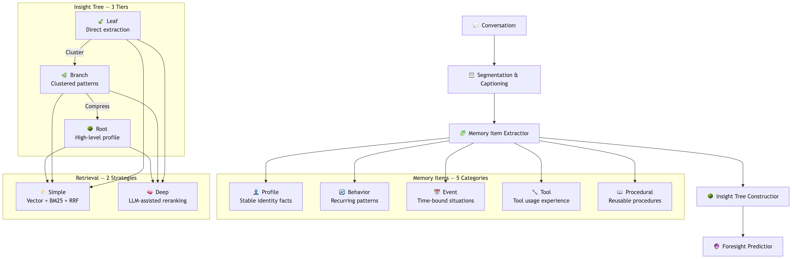

<p align="center">
  <h1 align="center">Memind Memory</h1>
</p>

<p align="center">
  <strong>面向 AI Agent 的自进化认知记忆系统 — 不只是存储，更是理解。</strong>
</p>

<p align="center">
  <a href="./README.md"></a>
  <a href="./README_zh.md"></a>
  <a href="https://github.com/openmemind/memind"></a>
</p>

<p align="center">
  <a href="#"></a>
  <a href="#"></a>
  <a href="#"></a>
  <a href="./LICENSE"></a>
  <a href="#"></a>
</p>

---

memind 是一个面向 AI Agent 的**层级认知记忆系统**，基于 Java 原生构建。它超越了简单的键值记忆 — memind 自动从对话中提取、组织和进化知识，构建结构化的 **Insight Tree**，让 Agent 真正理解和记忆。

它解决了 Agent 记忆的核心问题：**扁平无结构的存储**（记忆是孤立的事实，没有关联关系）和**知识无法进化**（记忆只会堆积，不会成长和整合）。

---

## 为什么选择 memind？

| 传统记忆系统 | memind |
|-------------|--------|
| 🗄️ 扁平键值存储 | 🌳 层级 Insight Tree（Leaf → Branch → Root） |
| 📝 只存储原始事实 | 🧠 自进化认知 — 记忆条目被逐层分析为多级洞察 |
| 🔍 单层级检索 | 🎯 多粒度检索（细节 → 摘要 → 画像） |
| 💰 依赖昂贵模型 | 🏆 gpt-4o-mini 即可达到 SOTA 性能 |
| 🔧 手动管理记忆 | ⚡ 全自动提取流水线 |

---

## 亮点

### 🌳 Insight Tree — 层级知识，而非扁平存储

Insight Tree 是 memind 的核心创新。不同于传统记忆系统存储孤立的事实，memind 通过三个层级**逐层提炼知识** — 每一层都能看到上一层看不到的模式：

| 层级 | 输入 | 产出 |
|------|------|------|
| 🍃 **Leaf** | 分组后的记忆条目 | 单个语义组内的洞察 |
| 🌿 **Branch** | 多个 Leaf | 同一维度内的跨组模式 |
| 🌳 **Root** | 多个 Branch | 跨维度的深层洞察，低层级无法发现 |

**示例 — 通过对话理解用户李伟：**

> 🍃 **Leaf**（来自 career_background 组）：
> "李伟有 8 年后端经验 — 在阿里巴巴工作 3 年，之后在一家金融科技公司带领 8 人团队，设计了基于 Java 17 + Spring Cloud + Kafka 的核心交易系统。"
>
> 🌿 **Branch**（整合 career + education + certifications）：
> "李伟是一位资深后端架构师，具备深厚的分布式系统专业能力，融合了浙大计算机科学的学术训练、阿里巴巴的大规模系统经验和金融科技的实战系统设计 — 技术广度与深度兼备。"
>
> 🌳 **Root**（跨维度 — identity × preferences × behavior）：
> "李伟偏好函数式编程和高代码质量（80% 测试覆盖率），加上保守的技术选型策略（要求 2 年以上生产验证），揭示了一种以长期代码可维护性为导向的性格特质，而非追求快速创新 — 建议应强调稳定性和经过验证的方案，而非前沿工具。"

每一层都揭示了上一层看不到的东西。Leaf 知道事实，Branch 看到模式，Root 理解这个人。

### 🏆 轻量模型实现 SOTA

在 LoCoMo 基准测试中仅使用 **gpt-4o-mini** 即达到 **86.88% 综合得分** — 一个轻量、高性价比的模型。这证明了智能的记忆架构比暴力堆模型更重要。

### ☕ Java 原生 — Java 生态首个 SOTA 级记忆系统

首个达到 SOTA 水平的 Java AI 记忆系统。基于 **Spring Boot 4.0** 和 **Spring AI 2.0** 构建，memind 原生适配 Java/Kotlin 企业技术栈，一行 Maven 依赖即可集成。

---

## 架构

memind 通过多阶段流水线处理对话，从原始对话到结构化知识：



### 双作用域记忆

memind 维护独立的记忆作用域，实现全面的 Agent 认知：

| 作用域 | 类别 | 用途 |
|--------|------|------|
| **USER** | Profile, Behavior, Event | 用户身份、偏好、关系、经历 |
| **AGENT** | Tool, Procedural | 工具使用模式、可复用流程、学习到的工作流 |

### 双检索策略

| 策略 | 工作原理 | 适用场景 |
|------|---------|---------|
| **Simple** | 向量搜索 + BM25 关键词匹配，通过 RRF（倒数排名融合）合并，自适应截断 | 低延迟、成本敏感场景 |
| **Deep** | LLM 辅助的查询扩展、充分性检查和重排序 | 需要推理的复杂查询 |

---

## 基准测试

### LoCoMo

在 [LoCoMo](https://github.com/snap-research/locomo) 基准测试上的评测结果，使用 **gpt-4o-mini**：

| Method     | Single Hop | Multi Hop | Temporal | Open Domain | 综合 |
|------------|-----------|-----------|----------|-------------|------|
| **memind** | **91.56** | **83.33** | **82.24** | **71.88** | **86.88** |

> memind 仅使用 gpt-4o-mini 即达到 SOTA 水平 — 一个轻量、高性价比的模型。

---

## 快速开始

### 安装

本地构建安装：

```bash
git clone https://github.com/openmemind-ai/memind.git
cd memind
mvn clean install
```

然后在你的项目 `pom.xml` 中添加 Spring Boot Starter：

```xml
<dependency>
  <groupId>com.openmemind.ai</groupId>
  <artifactId>memind-spring-boot-starter</artifactId>
  <version>0.0.1-SNAPSHOT</version>
</dependency>
```

### 配置

在 `application.yml` 中配置：

```yaml
spring:
  ai:
    openai:
      api-key: ${OPENAI_API_KEY}
      base-url: ${OPENAI_BASE_URL:https://api.openai.com}
      chat:
        options:
          model: gpt-4o-mini
      embedding:
        options:
          model: text-embedding-3-small

memind:
  store:
    type: sqlite
    sqlite:
      path: ./data/memind.db
```

### 使用

```java
// 创建记忆标识（用户 + Agent）
MemoryId memoryId = DefaultMemoryId.of("user-1", "my-agent");

// 从对话中提取知识
memory.addMessages(memoryId, messages).block();

// 检索相关记忆
var result = memory.retrieve(memoryId, "用户有什么偏好？",
        RetrievalConfig.Strategy.SIMPLE).block();
```

---

## 示例

克隆项目并运行示例，体验 memind 的能力：

```bash
git clone https://github.com/openmemind-ai/memind.git
cd memind
```

在 `memind-example/src/main/resources/application.yml` 中配置 API Key，然后运行：

```bash
# 基础提取 + 检索
mvn -pl memind-example -am spring-boot:run \
  -Dspring-boot.run.mainClass=com.openmemind.ai.memory.example.quickstart.QuickStartExample
```

| 示例 | 类 | 说明 |
|------|---|------|
| **QuickStart** | `quickstart.QuickStartExample` | 基础提取 + 检索流程 |
| **Insight** | `insight.InsightTreeExample` | Insight Tree 多层级生成（Leaf → Branch → Root） |
| **Foresight** | `foresight.ForesightExample` | 预测性记忆 — 预判用户需求 |
| **Tool** | `tool.ToolMemoryExample` | 工具调用追踪与程序性记忆 |

> 所有类位于 `com.openmemind.ai.memory.example` 包下。

---

## 核心能力

| 类别 | 能力 | 说明 |
|------|------|------|
| **提取** | 对话分段 | 流式消息的自动边界检测和分段 |
| | 记忆条目提取 | 跨 5 个类别提取结构化事实，自动去重 |
| | Insight Tree 构建 | 层级知识构建：Leaf → Branch → Root |
| | 前瞻预测 | 基于对话模式预测用户未来需求 |
| | 工具调用统计 | 追踪工具使用模式和成功率 |
| **检索** | Simple 策略 | 向量 + BM25 混合搜索，RRF 融合，自适应截断 |
| | Deep 策略 | LLM 辅助的查询扩展、充分性检查和重排序 |
| | 意图路由 | 自动判断是否需要检索 |
| | 多粒度检索 | 根据查询需求从 Insight Tree 任意层级检索 |
| **集成** | Spring Boot Starter | 通过 `memind-spring-boot-starter` 自动配置 |
| | 插件架构 | 可插拔的存储（SQLite、MySQL）和追踪（OpenTelemetry） |

---

## 技术栈

| 组件 | 技术 |
|------|------|
| 语言 | Java 21 |
| 框架 | Spring Boot 4.0, Spring AI 2.0 |
| 数据存储 | SQLite（默认）, MySQL（插件） |
| 向量存储 | Qdrant, JSON 文件（示例用） |
| 可观测性 | OpenTelemetry, Micrometer |
| 构建 | Maven |

---

## 贡献

欢迎贡献！请随时提交 [Issue](https://github.com/openmemind/memind/issues) 或发起 Pull Request。

## 许可证

[Apache License 2.0](LICENSE)
